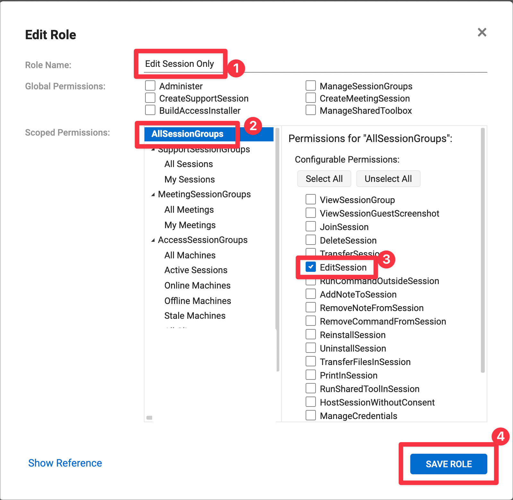

# Update-CustomProperties
This script is intended to be run from your RMM. It will edit the custom properties of assets in your Connectwise Control server. You can then create a session group in Control to automatically organize all your endpoints.

 
 

## Requirements
1. On-premise Connectwise Control server.
2. A Control user that does NOT require MFA.
3. A Control user with EditSession permission.
   - STRONGLY recommended to create a role that has nothing but the EditSession permission.

 
 

### Create Edit Session Only Role
1. Create a new role and name it Edit Session Only.
2. Select AllSessionGroups.
3. Select EditSession permission.
4. Click Save Role.
5. Verify you see Edit Session Only with only 1 permission assigned.
 
 

| Create Role | Verify Role |
| --- | --- |
|  |  |

 
 

### Create User
- Create new user. Username, password, and email address are required.
- <b>Be sure to use a very long password (40+ chars)</b>
- Verify that your user is assigned to the Edit Session Only role.
 
 

| Create User | Verify User |
| --- | --- |
|  | 
